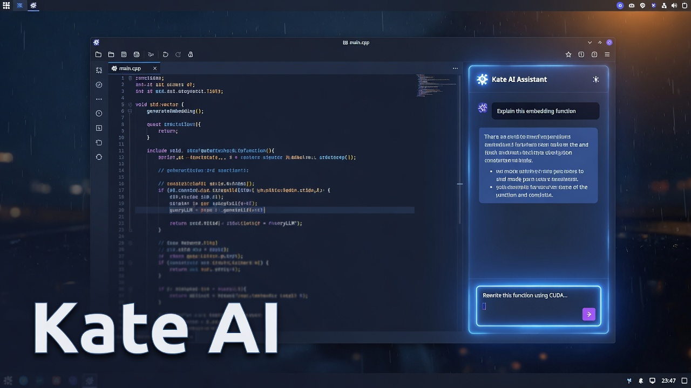

# Kate AI

<p align="center">
  
</p>

<p align="center">
  <strong>An AI coding agent for <a href="https://kate-editor.org/">Kate</a></strong><br>
  Chat, sandboxed tools, and permission asks — Grok, OpenAI, and OpenRouter.
</p>

<p align="center">
  
  
  
  
</p>

Kate AI adds an AI coding assistant to the Kate text editor: a chat prompt in a tool view, an agent that can read and write your project, and a permission bar before anything destructive happens.

---

## Install from git

Kate does not need a world-readable system plugin. The **default** install is per-user: the `.so` lives in your home directory, owned by you, mode `700`. Other accounts on the machine cannot read it. No `sudo`.

```bash
git clone https://github.com/<you>/kate-ai.git
cd kate-ai
./install.sh          # same as ./install.sh --user
```

That installs:

| Path | Mode | Why |
| --- | --- | --- |
| `~/.local/lib/qt6/plugins/kf6/ktexteditor/kateai.so` | `700` | Only your user can load the plugin |
| `~/.config/plasma-workspace/env/kate-ai.sh` | `600` | KDE session prepends `QT_PLUGIN_PATH` |
| `~/.config/environment.d/50-kate-ai.conf` | `600` | systemd user session does the same |

Kate’s distro build only scans `/usr/lib/qt6/plugins`. The two env files teach **your** Kate to also look in `~/.local`. They do not replace the system plugin path.

Use it immediately in this terminal:

```bash
export QT_PLUGIN_PATH="$HOME/.local/lib/qt6/plugins${QT_PLUGIN_PATH:+:$QT_PLUGIN_PATH}"
kate
```

Then **Settings → Configure Kate → Plugins → Kate AI**. From the application menu, log out and back in once so the session picks up `QT_PLUGIN_PATH`.

Uninstall:

```bash
./uninstall.sh
```

### System-wide (every user on the machine)

This is the only case that needs world-readable `755`: the file is owned by root, and Kate runs as a normal user, so “other” must be able to `mmap` it.

```bash
./install.sh --system
```

### Manual user install

Prefer `./install.sh`. CMake’s relative `PATH` cache can otherwise install into the source tree. The script copies the built `.so` itself:

```bash
cmake -S . -B build -DCMAKE_BUILD_TYPE=Release
cmake --build build -j"$(nproc)"
mkdir -p ~/.local/lib/qt6/plugins/kf6/ktexteditor
install -m 700 build/bin/kf6/ktexteditor/kateai.so ~/.local/lib/qt6/plugins/kf6/ktexteditor/kateai.so
```

### Dependencies

| Distro | Packages |
| --- | --- |
| Arch / CachyOS / Manjaro | `kate extra-cmake-modules qt6-base kf6-ktexteditor kf6-kcoreaddons kf6-ki18n kf6-kxmlgui kf6-kconfigwidgets bubblewrap` |
| Fedora | `kate extra-cmake-modules qt6-qtbase-devel kf6-ktexteditor-devel kf6-kcoreaddons-devel kf6-ki18n-devel bubblewrap` |
| Debian / Ubuntu (25.04+) | `kate cmake extra-cmake-modules qt6-base-dev libkf6texteditor-dev libkf6coreaddons-dev libkf6i18n-dev libkf6xmlgui-dev libkf6configwidgets-dev bubblewrap` |

Needs **Kate ≥ 24.08** (KF6), **Qt ≥ 6.5**, **CMake ≥ 3.25**, and `bwrap` for sandboxed shell.

---

## Features

- **Chat panel** on the right — multi-line prompt, Enter to send, Shift+Enter for a new line
- **Streaming** replies and an agent loop (model → tools → model, up to 20 iterations)
- **Providers via API keys:** Grok (xAI), OpenAI, OpenRouter
- **Tools:** `read_file`, `write_file`, `edit_file`, `list_dir`, `grep`, `glob`, `bash`
- **Permission asks** before writes and non-read-only commands — Allow / Allow for session / Deny
- **Sandbox profiles** — workspace, read-only, strict, or off; shell runs under [bubblewrap](https://github.com/containers/bubblewrap)
- **Secrets stay blocked** — `.env`, `*.pem`, `*.key`, `.ssh`, AWS credentials, GnuPG
- **Editor-aware** — reads/writes go through open Kate documents so unsaved buffers stay in sync
- **Ask Kate AI About This** in the editor context menu

```text
You ──► LLM (Grok / OpenAI / OpenRouter)
          │
          ├── stream text into the panel
          └── tool calls
                ├── read tools          → auto
                ├── write / bash        → permission bar
                └── sandbox + deny globs
                      └── result back to the LLM
```

---

## Usage

| Action | How |
| --- | --- |
| Open the panel | **Ctrl+Alt+A**, or **View → Tool Views → Kate AI** |
| Send a prompt | **Enter** |
| New line in the prompt | **Shift+Enter** |
| New chat | **Ctrl+Alt+N** or the **New chat** button |
| Stop a turn | **Stop** |
| Ask about the selection | Right-click in the editor → **Ask Kate AI About This** |

The toolbar at the top of the panel switches provider, model, permission mode, and sandbox without opening settings.

---

## Configuration

**Settings → Configure Kate → Kate AI**

| Setting | Default |
| --- | --- |
| Provider | Grok (xAI) — `https://api.x.ai/v1` |
| Grok model | `grok-4.5` |
| OpenAI | `https://api.openai.com/v1` · `gpt-4.1` |
| OpenRouter | `https://openrouter.ai/api/v1` · `x-ai/grok-4` |

API keys:

- [Grok / xAI](https://console.x.ai)
- [OpenAI](https://platform.openai.com/api-keys)
- [OpenRouter](https://openrouter.ai/keys)

Keys are stored in Kate’s config (`KateAI` group). Only the selected provider receives its key.

### Permission modes

| Mode | What runs without asking |
| --- | --- |
| **Ask** (default) | Read-only tools and read-only shell (`ls`, `git status`, …) |
| **Accept edits** | File writes too; shell still prompts |
| **Always approve** | Tools run without a prompt |

Hard-denied commands (`rm -rf /`, `mkfs`, `dd` to devices, curl-piped-to-shell) are blocked in every mode.

### Sandbox profiles

| Profile | Reads | Writes | Child network |
| --- | --- | --- | --- |
| **Workspace** | Anywhere except deny globs | Workspace only | Allowed |
| **Read-only** | Anywhere except deny globs | Blocked | Blocked |
| **Strict** | Workspace only | Workspace only | Blocked |
| **Off** | Deny globs only | Deny globs only | Unsandboxed |

The workspace is the nearest parent with `.git` or `.kateproject`, otherwise the active file’s directory.

---

## Development

```bash
cmake -S . -B build -DCMAKE_BUILD_TYPE=Debug
cmake --build build -j"$(nproc)"
ctest --test-dir build --output-on-failure
```

Always configure out-of-source (`-B build`, not `cmake .`). Do not copy a `build/` directory between machines or users — it embeds absolute paths such as `/home/<someone>/…`. `./install.sh` and `./build.sh` throw away a cache that belongs to another source path, or they switch to `build-$USER` if `build/` is not writable.

| Path | Role |
| --- | --- |
| `src/plugin*.cpp` | Kate / KTextEditor glue, tool view, actions |
| `src/chatwidget.cpp` | Prompt window and transcript |
| `src/agentloop.cpp` | LLM ↔ tool loop |
| `src/llmclient.cpp` | OpenAI-compatible streaming (`/v1/chat/completions`) |
| `src/tools.cpp` | File and shell tools |
| `src/sandbox.cpp` | Path jail, deny globs, bubblewrap |
| `src/permissions.cpp` | Ask / accept-edits / always-approve |
| `tests/` | Sandbox, permission, and SSE parser tests |

---

## Troubleshooting

| Problem | Fix |
| --- | --- |
| Plugin missing after **user** install | Start Kate from a shell with `export QT_PLUGIN_PATH="$HOME/.local/lib/qt6/plugins${QT_PLUGIN_PATH:+:$QT_PLUGIN_PATH}"`. For the app menu, log out/in once. Check `ls -l ~/.local/lib/qt6/plugins/kf6/ktexteditor/kateai.so` is `-rwx------`. |
| Plugin missing after **system** install | Fully quit Kate. Confirm `ls -l $(qtpaths --plugin-dir)/kf6/ktexteditor/kateai.so` is `-rwxr-xr-x`. If it is `--x`, run `sudo chmod 755` on that file. |
| `cmake` complains about a foreign `/home/…` path or `CMakeCache.txt` | Leftover `build/` from another user or machine. `rm -rf build` and run `./install.sh` again. |
| `cmake` *Operation not permitted* on `prefix.sh` | Stale files in `build/` from another user. `rm -rf build` and configure again. |
| Sandboxed `bash` fails | Install `bubblewrap` (`bwrap`). File tools still work without it. |
| No API key error | Open **Settings → Configure Kate → Kate AI** and paste a key for the selected provider. |

---

## License

[LGPL-2.1-or-later](LICENSE) — same family as Kate / KTextEditor plugins.
