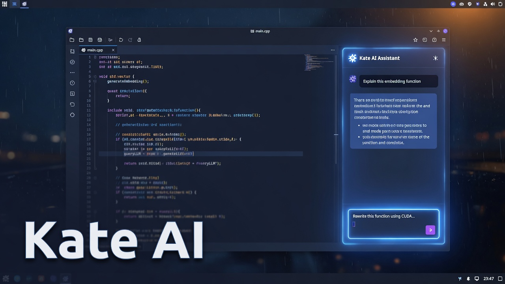

# Kate AI

<p align="center">
  
</p>

<p align="center">
  <strong>An AI coding agent that lives inside <a href="https://kate-editor.org/">Kate</a></strong><br>
  Chat, project tools, sandboxed shell, and permission asks — Grok, OpenAI, OpenRouter, local models, and ACP.
</p>

<p align="center">
  
  
  
  
</p>

Kate AI is a [KTextEditor](https://invent.kde.org/frameworks/ktexteditor) plugin that turns Kate into an agentic coding environment. You stay in the editor you already use: the agent reads the workspace, edits open documents in place, runs sandboxed commands, and asks before anything destructive.

It is useful when you want a capable coding agent **without leaving Kate** — native Qt/KF6, per-user install, your API keys, your models (cloud or local), and a permission bar on every write.

---

## Why use it

Kate is a serious editor for C++, Qt, KDE, and systems work. Kate AI keeps that workflow intact and adds an agent that already knows the file you are looking at.

| You need | Kate AI does |
| --- | --- |
| Stay in Kate | Tool view on the right (`Ctrl+Alt+A`) in the same window. |
| Work on the current project | Reads the workspace, open tabs, cursor, and selection as context. |
| Edit with the buffer, not a fork | `read_file` / `write_file` / `edit_file` go through open Kate documents so unsaved work stays in sync. |
| Inspect before changing | **Plan mode** is read-only: the model can search and propose a plan, and cannot write or run shell. |
| See what the agent is doing | Streaming replies, collapsible reasoning, a live plan checklist, and tool cards with diffs. |
| Stay in control | Permission bar (Allow / Allow for session / Deny), sandbox profiles, deny globs for secrets. |
| Pick a model | Grok, OpenAI, OpenRouter, OpenAI-compatible (Ollama, vLLM, LocalAI), Claude-compatible, ACP. |
| Teach the repo | Optional `KATEAI.md` at the workspace root is loaded as project instructions. |

Typical uses: explain a selection, fix a bug in the current file, refactor with a visible diff, add tests, explore an unfamiliar tree via the project graph, then apply focused patches after you approve them.

---

## Features

### Chat panel

- Tool view on the right: **View → Tool Views → Kate AI**, or **Ctrl+Alt+A**
- Multi-line prompt: **Enter** sends, **Shift+Enter** inserts a newline
- Auto-growing composer, prompt history (Up/Down on an empty first line)
- **@ mentions** for the active file, selection, workspace, open documents, and relative paths
- Markdown replies with a copy button
- Token estimate on the composer
- Stop the current turn at any time
- Scroll-to-bottom control when you leave the live stream
- Toolbar: provider, model (searchable menu), permission mode, sandbox, Agent/Plan, thinking, reasoning effort, new chat, history, settings

### Agent loop

The model can call tools, read the results, and continue until the task is done (bounded by max model requests, max tool calls, and a requests-per-minute cap).

- Streaming text and hidden reasoning (`reasoning_content` / `<thinking>`)
- Structured **implementation plan** rendered as a checklist that updates as steps complete
- Parallel tool calls when the provider supports them
- Self-critique and required **verification** after file mutations (read, test, build, or lint)
- Adaptive temperature (higher while exploring, lower while applying edits)
- Automatic retry on rate limits, 5xx, and network errors (exponential backoff)
- Repeat-call detection so the agent does not loop on the same failed tool
- Context compression and smart truncation so long sessions stay within the window

```text
You ──► LLM (Grok / OpenAI / OpenRouter / local / ACP)
          │
          ├── thinking (collapsible) + plan checklist
          ├── stream the answer into the panel
          └── tool calls
                ├── read / search / graph   → auto
                ├── write / edit / bash     → permission bar + diff preview
                └── sandbox + deny globs
                      └── result back to the LLM
```

### Tools

| Tool | What it does |
| --- | --- |
| `read_file` | Read a UTF-8 file; `offset` / `limit` for large files |
| `write_file` | Create or overwrite a file (open Kate buffer if the file is already open) |
| `edit_file` | Exact-string replace; optional `replace_all` |
| `multi_edit_file` | Apply multiple non-contiguous edits to a file in a single tool call |
| `list_dir` | List a directory |
| `grep` | Regex search with optional glob, case-insensitivity, and context lines |
| `glob` | Find paths (`**/*.h`, `src/**/*.cpp`, …) |
| `bash` | Run a command in the workspace under the active sandbox |
| `query_project_graph` | Query indexed files, symbols, imports, dependents, and paths |

In **Plan mode** the model only receives `read_file`, `list_dir`, `grep`, `glob`, and `query_project_graph`.

### Tool cards and diffs

Each tool call appears as a compact card in the transcript (icon, name, shell-style summary). Expand it for arguments and output.

- `write_file` / `edit_file` / `multi_edit_file` show a **unified diff** in the card before you approve
- Other tools show a text preview (command, grep hits, graph summary)
- Older cards auto-collapse after a configurable count so long runs stay responsive
- **Accept edits** mode collects pending writes in an edit tracker: accept all or reject all

### Editor integration

Kate AI is a first-class KTextEditor plugin, so it sees the same documents you do.

- Active file, cursor line, selection (up to 4k), and the list of open files are sent as editor context
- Reads and writes prefer the in-memory buffer over disk
- Right-click **Kate AI** submenu on any editor view:
  - **Ask Kate AI About This** — explain the selection (or current line)
  - **Fix Selection** — find problems, explain, apply
  - **Refactor Selection** — clarity and maintainability, then apply
  - **Add Tests for Selection** — propose coverage first
- Workspace root is the nearest parent with `.git` or `.kateproject`, otherwise the active file’s directory

### Thinking and plan mode

- **Thinking mode** captures model reasoning in a collapsible “Reasoning” block (markdown, full reasoning block expandable in chat)
- Auto-collapse when the visible answer starts; click to expand later
- **Plan mode** (toolbar): read-only tools only, for inspection and an implementation plan
- Structured plans render as an interactive checklist; steps can be marked complete as the agent works
- Reasoning effort (`minimal` / `low` / `medium` / `high`) for models that expose it (e.g. Grok reasoning)

### Permissions and sandbox

Nothing destructive runs silently.

| Permission mode | What runs without asking |
| --- | --- |
| **Ask** (default) | Read-only tools and read-only shell (`ls`, `git status`, …) |
| **Accept edits** | File writes too; shell still prompts; pending edits can be accepted or rejected as a batch |
| **Always approve** | Tools run without a prompt |

Hard-denied commands (`rm -rf /`, `mkfs`, `dd` to devices, curl-piped-to-shell) are blocked in every mode.

| Sandbox | Reads | Writes | Child network |
| --- | --- | --- | --- |
| **Workspace** | Anywhere except deny globs | Workspace only | Allowed |
| **Read-only** | Anywhere except deny globs | Blocked | Blocked |
| **Strict** | Workspace only | Workspace only | Blocked |
| **Off** | Deny globs only | Deny globs only | Unsandboxed |

Shell isolation depends on the OS: [bubblewrap](https://github.com/containers/bubblewrap) on Linux, `sandbox-exec` on macOS, and workspace-cwd plus command policy on Windows. File tools still work if the OS sandbox helper is missing.

**Always blocked paths:** `.env`, `.env.*`, `*.pem`, `*.key`, `id_rsa` / `id_ecdsa` / `id_ed25519`, `.ssh/**`, AWS credentials, GnuPG, `.netrc`, `*.p12`, `*.pfx`. Extra deny globs can be added in settings.

### Providers and models

| Provider | Default endpoint | Default model |
| --- | --- | --- |
| **Grok (xAI)** | `https://api.x.ai/v1` | `grok-4.5` |
| **OpenAI** | `https://api.openai.com/v1` | `gpt-4.1` |
| **OpenRouter** | `https://openrouter.ai/api/v1` | `x-ai/grok-4` |
| **OpenAI compatible** | `http://localhost:11434/v1` | Ollama, LocalAI, vLLM, … |
| **Claude compatible** | `https://api.anthropic.com/v1` | Anthropic Messages API / Bedrock-style |
| **ACP** | `http://localhost:8080` | Agent Communication Protocol |

ACP API formats (Settings → Kate AI → AI Providers → ACP):

| Format | Endpoint | Auth |
| --- | --- | --- |
| OpenAI compatible (default) | `/chat/completions` | `Bearer` |
| Anthropic / Claude compatible | `/v1/messages` | `x-api-key` |
| ACP native | `/acp/v1/chat/completions` | `Bearer` |

The model menu fetches live catalogs when the provider supports it; you can still type a model id. Only the selected provider’s key is sent. Keys live in Kate’s config (`KateAI` group).

### Sessions and history

- The active conversation is restored when Kate restarts
- Conversation list in the panel: switch, delete, start new (`Ctrl+Alt+N`)
- Configurable cap on saved conversations (default 50)
- Extra system prompt and `KATEAI.md` (optional compression) are included as project context

### Project graph

On workspace load the plugin indexes files, symbols, imports, and relationships. The agent queries it with `query_project_graph` (`summary`, `nodes`, `edges`, `dependencies`, `dependents`, `find_related`, `find_path`, `dependency_chain`) so it can map structure before grepping blindly. Node/edge caps and content-preview length are configurable.

### Configuration surface

**Settings → Configure Kate → Kate AI**, or the gear in the panel. Tabs:

- **AI Providers** — keys, default models, custom endpoints, ACP format
- **Security & Permissions** — permission mode, sandbox, command timeout, extra deny globs, tool-card collapse
- **Agent & Context** — plan mode, thinking, budgets, `KATEAI.md`, extra instructions, compression, temperature / top-p / max tokens, reasoning effort, self-critique, parallel tools, verbosity, structured thinking/planning, verification, adaptive temperature, context window reserve, saved-conversation cap

---

## Install from git

Kate does not need a world-readable system plugin. The **default** install is per-user: the plugin lives in your home directory, owned by you, mode `700` on Unix. Other accounts on the machine cannot read it. No `sudo`.

```bash
git clone https://github.com/KateAI/kate-ai.git
cd kate-ai
./install.sh --deps   # distro / Homebrew packages
./install.sh          # same as ./install.sh --user
```

On Windows:

```powershell
powershell -ExecutionPolicy Bypass -File .\install.ps1
```

That installs (Linux):

| Path | Mode | Why |
| --- | --- | --- |
| `~/.local/lib/qt6/plugins/kf6/ktexteditor/kateai.so` | `700` | Only your user can load the plugin |
| `~/.config/plasma-workspace/env/kate-ai.sh` | `600` | KDE session prepends `QT_PLUGIN_PATH` |
| `~/.config/environment.d/50-kate-ai.conf` | `600` | systemd user session does the same |

Kate’s distro build only scans `/usr/lib/qt6/plugins`. The two env files teach **your** Kate to also look in `~/.local`. They do not replace the system plugin path.

Use it immediately in this terminal:

```bash
export QT_PLUGIN_PATH="$HOME/.local/lib/qt6/plugins${QT_PLUGIN_PATH:+:$QT_PLUGIN_PATH}"
kate
```

Then **Settings → Configure Kate → Plugins → Kate AI**. From the application menu, log out and back in once so the session picks up `QT_PLUGIN_PATH`.

Uninstall:

```bash
./uninstall.sh
```

On Windows: `.\install.ps1 -Uninstall`.

### System-wide (every user on the machine)

This is the only case that needs world-readable `755` on Unix: the file is owned by root, and Kate runs as a normal user, so “other” must be able to `mmap` it.

```bash
./install.sh --system
```

### Distro packages

`./install.sh --package` builds a native package from this tree. Recipes live under `packaging/`.

| Family | How |
| --- | --- |
| Arch / CachyOS / Manjaro | `./install.sh --deps && ./install.sh --package` (or `cd packaging/arch && makepkg -si` after placing `kateai-<ver>.tar.gz` from `packaging/mk-source-tarball.sh`) |
| Fedora / Asahi Remix | `./install.sh --deps && ./install.sh --package` → RPM under `packaging/dist/` |
| Debian / Ubuntu 25.04+ | `./install.sh --deps && ./install.sh --package` → `.deb` under `packaging/dist/` |

Then install the artifact with `pacman -U`, `dnf install`, or `apt install ./kateai_*.deb`.

### macOS

Install Kate from Homebrew (`brew install --cask kate`) and the KF6/Qt build stack, then:

```bash
./install.sh --deps
./install.sh
```

The script copies `kateai.so` into `~/Library/Application Support/kate/lib/qt6/plugins/kf6/ktexteditor/` and, when the app bundle is writable, next to Kate.app’s other ktexteditor plugins. A LaunchAgent prepends `QT_PLUGIN_PATH` for GUI Kate.

A Homebrew-built plugin may not load in the Craft-built Kate.app. For a matching ABI, build with [KDE Craft](https://develop.kde.org/docs/getting-started/building/craft/) using `packaging/craft/kateai.py`.

### Windows

Kate for Windows is a Craft/MSVC build. The plugin has to use the same toolchain.

1. Install [KDE Craft](https://develop.kde.org/docs/getting-started/building/craft/) and Kate.
2. Copy `packaging/craft/kateai.py` into your Craft blueprints tree (for example `extragear/kateai/kateai.py`).
3. In the Craft shell: `craft kateai`
4. Or from a Craft shell in this repo: `powershell -ExecutionPolicy Bypass -File .\install.ps1`

`install.ps1` copies `kateai.dll` into Kate’s `kf6\ktexteditor` directory when it can write there, otherwise into `%LOCALAPPDATA%\KateAI\plugins` and sets the user `QT_PLUGIN_PATH`. The Microsoft Store Kate is not supported.

### Manual user install

Prefer `./install.sh`. CMake’s relative `PATH` cache can otherwise install into the source tree. The script copies the built plugin itself:

```bash
cmake -S . -B build -DCMAKE_BUILD_TYPE=Release
cmake --build build -j"$(nproc)"
mkdir -p ~/.local/lib/qt6/plugins/kf6/ktexteditor
install -m 700 build/bin/kf6/ktexteditor/kateai.so ~/.local/lib/qt6/plugins/kf6/ktexteditor/kateai.so
```

### Dependencies

| Platform | Packages |
| --- | --- |
| Arch / CachyOS / Manjaro | `kate extra-cmake-modules cmake ninja qt6-base ktexteditor kcoreaddons ki18n kxmlgui kconfigwidgets kconfig kwidgetsaddons bubblewrap` |
| Fedora / Asahi | `kate extra-cmake-modules cmake gcc-c++ ninja-build qt6-qtbase-devel kf6-ktexteditor-devel kf6-kcoreaddons-devel kf6-ki18n-devel kf6-kxmlgui-devel kf6-kconfigwidgets-devel bubblewrap` |
| Debian / Ubuntu (25.04+) | `kate cmake extra-cmake-modules ninja-build qt6-base-dev libkf6texteditor-dev libkf6coreaddons-dev libkf6i18n-dev libkf6xmlgui-dev libkf6configwidgets-dev libkf6config-dev libkf6widgetaddons-dev bubblewrap` |
| macOS | Homebrew: `cmake extra-cmake-modules ninja qtbase kcoreaddons ki18n kconfig kconfigwidgets kxmlgui kwidgetsaddons` and cask `kate`; Craft recommended to match Kate.app |
| Windows | KDE Craft + Kate (MSVC). See `packaging/windows/install.ps1` |

Needs **Kate ≥ 24.08** (KF6), **Qt ≥ 6.5**, **CMake ≥ 3.25**. Sandboxed shell uses `bwrap` on Linux and `sandbox-exec` on macOS.

---

## Usage

| Action | How |
| --- | --- |
| Open the panel | **Ctrl+Alt+A**, or **View → Tool Views → Kate AI**, or **Tools → Kate AI → Show Kate AI** |
| Send a prompt | **Enter** |
| New line in the prompt | **Shift+Enter** |
| Mention a file | Type `@` then pick from open documents / `active` / `selection` / `workspace` |
| Previous prompt | **Up** on an empty first line |
| New chat | **Ctrl+Alt+N** or the **New chat** button |
| Past conversations | History button in the panel |
| Stop a turn | **Stop** |
| Approve a tool | Permission bar: Allow / Allow for session / Deny |
| Ask about the selection | Right-click → **Kate AI → Ask Kate AI About This** |
| Fix / refactor / tests | Right-click → **Kate AI** submenu |

Paste an API key under **Settings → Configure Kate → Kate AI**, pick a provider and model in the panel toolbar, and ask about the current file.

### Plan mode and project instructions

Choose **Plan** in the chat toolbar when you want an implementation plan before any edits. In this mode Kate AI only receives read-only tools; it cannot run shell commands or change files. Switch back to **Agent** when you want it to apply the plan.

For repository-specific guidance, create a `KATEAI.md` at the workspace root. It can describe architecture, style, test commands, and contribution rules. Loading it is enabled by default and can be disabled from **Configure Kate AI**.

---

## Configuration

**Settings → Configure Kate → Kate AI**

API keys:

- [Grok / xAI](https://console.x.ai)
- [OpenAI](https://platform.openai.com/api-keys)
- [OpenRouter](https://openrouter.ai/keys)
- OpenAI-compatible — local server URL (Ollama default `http://localhost:11434/v1`)
- Claude-compatible — Anthropic or compatible gateway
- ACP — your ACP server endpoint and API key

Keys are stored in Kate’s config (`KateAI` group). Only the selected provider receives its key.

---

## Development

```bash
cmake -S . -B build -DCMAKE_BUILD_TYPE=Debug
cmake --build build -j"$(nproc)"
ctest --test-dir build --output-on-failure
```

Always configure out-of-source (`-B build`, not `cmake .`). Do not copy a `build/` directory between machines or users — it embeds absolute paths such as `/home/<someone>/…`. `./install.sh` and `./build.sh` throw away a cache that belongs to another source path, or they switch to `build-$USER` if `build/` is not writable.

| Path | Role |
| --- | --- |
| `src/plugin*.cpp` | Kate / KTextEditor glue, tool view, actions |
| `src/chatwidget.cpp` | Prompt window, transcript, thinking, plan checklist |
| `src/toolcallwidget.cpp` | Inline tool cards and diff preview |
| `src/promptedit.cpp` | Composer, @ completion, prompt history |
| `src/edittracker.cpp` | Accept / reject pending writes |
| `src/agentloop.cpp` | LLM ↔ tool loop, verification, budgets |
| `src/llmclient.cpp` | Streaming (`/v1/chat/completions`, Anthropic, ACP), retries |
| `src/tools.cpp` | File, grep, glob, bash, project-graph tools |
| `src/graph/` | Project graph index and queries |
| `src/sandbox.cpp` | Path jail, deny globs, bubblewrap |
| `src/permissions.cpp` | Ask / accept-edits / always-approve |
| `src/sessionstore.cpp` | Conversation persistence |
| `src/documentbridge.cpp` | Open Kate buffers vs disk |
| `tests/` | Sandbox, permission, SSE parser, retry, session, prompt tests |

---

## Troubleshooting

| Problem | Fix |
| --- | --- |
| Plugin missing after **user** install | Start Kate from a shell with `export QT_PLUGIN_PATH="$HOME/.local/lib/qt6/plugins${QT_PLUGIN_PATH:+:$QT_PLUGIN_PATH}"`. For the app menu, log out/in once. Check `ls -l ~/.local/lib/qt6/plugins/kf6/ktexteditor/kateai.so` is `-rwx------`. On macOS, confirm the LaunchAgent and/or a copy inside Kate.app. On Windows, confirm `kateai.dll` next to Kate or `%LOCALAPPDATA%\KateAI\plugins`. |
| Plugin missing after **system** install | Fully quit Kate. Confirm `ls -l $(qtpaths --plugin-dir)/kf6/ktexteditor/kateai.so` is `-rwxr-xr-x`. If it is `--x`, run `sudo chmod 755` on that file. |
| `cmake` complains about a foreign `/home/…` path or `CMakeCache.txt` | Leftover `build/` from another user or machine. `rm -rf build` and run `./install.sh` again. |
| `cmake` *Operation not permitted* on `prefix.sh` | Stale files in `build/` from another user. `rm -rf build` and configure again. |
| Sandboxed `bash` fails | On Linux install `bubblewrap` (`bwrap`). On macOS `sandbox-exec` is part of the OS. File tools still work without OS isolation. |
| No API key error | Open **Settings → Configure Kate → Kate AI** and paste a key for the selected provider. |

---

## License

[LGPL-2.1-or-later](LICENSE) — same family as Kate / KTextEditor plugins.
